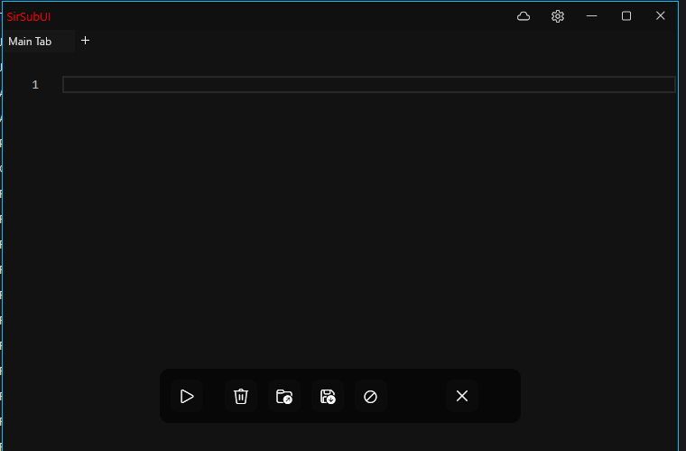
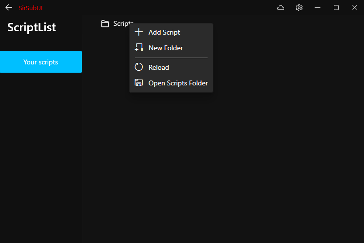
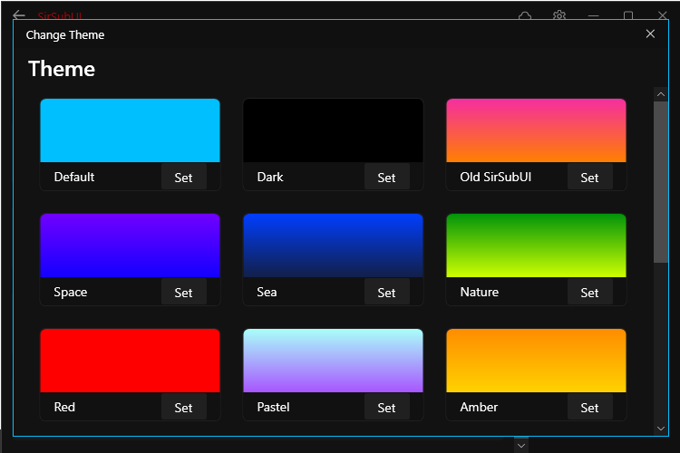
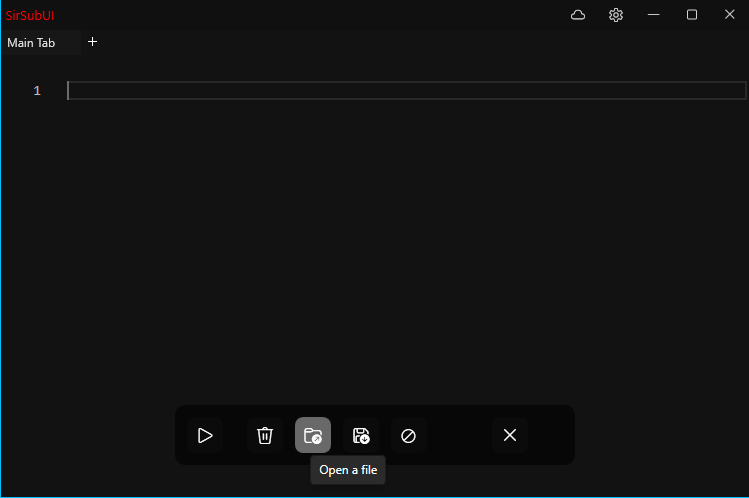

# SirSubUI
custom ui for sirhurt

# Installation
Just extract the folder into your sirhurt folder or somewhere else doesnt really matter.

# Features

Auto inject & Multi tab support for script editing!

Saved Scripts folder!

Custom Color Themes!

hover effects lmao

